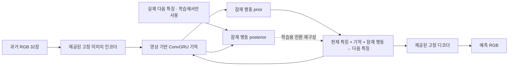

# Q3 · Video and action-conditioned world models

## 행동 라벨 전체를 사용하는 현재 기본 모델

[행동 + 프레임 변화량 T4 학습 노트북](https://colab.research.google.com/github/seungjoolee24/krafton-q3-video-worldmodel/blob/main/notebooks/train_action_difference_t4.ipynb)
· [모델 구조와 시간 정렬](docs/ACTION_MODEL.md)
· [모델 코드](src/action_wam/model.py)

행동 라벨이 있는 전체 200개를 기존 에피소드 분할대로 **185개 학습 / 15개 검증**에 사용합니다.
비라벨 영상과 이전 영상 전용 모델의 가중치는 이 실험에서 사용하지 않습니다. 제공된 시각 stem은 고정합니다.
과거 영상 32장·행동 31개로 상태를 추정하고, 주어진 미래 행동 32개로 미래 영상 32장을 자율 예측합니다.
`a[t-1]`은 `I[t-1] → I[t]` 변화와 연결하고, 관측 특징의 1·4·8프레임 차이와 모든 중간 행동을 ConvGRU에 입력합니다.
새 전이 모델은 438,624 파라미터이며, T4에서 batch 4·FP16·4,000 업데이트가 기본입니다.
움직임을 강조한 특징 손실에 희소 RGB·윤곽 손실을 더합니다. 자세한 설정은 `configs/action_t4.json`에 있습니다.

데이터 ZIP은 행동 라벨이 있는 200개 MP4·NPZ와 공통 kit 파일만 포함한 175 MB 묶음입니다.
노트북은 Drive의 `krafton-q3-video-worldmodel/data/`에서 분할 ZIP을 합쳐 체크섬을 검증합니다.
특징·원본 RGB·행동 캐시는 런타임 로컬 디스크에 약 10.2 GB를 사용하며, 결과는 Drive의
`runs/action-difference-t4-v1/`에 저장합니다. 학습·검증·로그·체크포인트는 이전 실험과 별도로 보존합니다.

15개 검증 영상의 RGB MSE·물체 영역 보조 오차·Copy-last·1/8/16/32프레임 오차와 행동 입력 진단을 기록합니다.
공식 예측 점수는 계산하지 않으며, 아직 3-2 제어와 공식 7개 ONNX 제출 패키지는 포함하지 않습니다.

## 이전 영상 전용 실험

[](https://colab.research.google.com/github/seungjoolee24/krafton-q3-video-worldmodel/blob/main/notebooks/train_video_only_colab.ipynb)

T4에서 30분 안에 첫 결과를 확인하는 설정:
[짧은 검증 노트북](https://colab.research.google.com/github/seungjoolee24/krafton-q3-video-worldmodel/blob/main/notebooks/validate_t4_30min.ipynb).
같은 모델을 학습 16개·검증 4개 영상으로 최대 300회 업데이트합니다.
약 20MB의 별도 영상 묶음을 사용하고 학습에 10분 상한을 둡니다.
학습 전후의 32프레임 예측, copy-last 기준선, 손실, 비교 영상을 저장합니다.
GPU 할당과 로그인 지연은 실행 시 확인해야 하며, 짧은 결과를 전체 성능으로 일반화하지 않습니다.

[T4 확장 학습 노트북](https://colab.research.google.com/github/seungjoolee24/krafton-q3-video-worldmodel/blob/main/notebooks/train_t4_expanded.ipynb)은
첫 검증의 가중치에서 학습 128개·검증 32개 영상으로 **추가 2,000회** 업데이트합니다.
새 optimizer로 시작하고 같은 검증 32개에서 학습 전후를 비교합니다. 결과는 별도 실행 폴더에 저장합니다.

[T4 연속 학습 노트북](https://colab.research.google.com/github/seungjoolee24/krafton-q3-video-worldmodel/blob/main/notebooks/continue_t4_6000.ipynb)은
같은 128/32 영상으로 2,000번 체크포인트에서 **6,000번까지 추가 4,000번** 학습합니다.
Optimizer·난수·step을 복원하며 32프레임 예측을 계속 학습합니다. 500번마다 검증하고
이전 최저 오차 모델을 새 결과 폴더에도 보존합니다.

영상만으로 학습하는 Q3 월드 모델의 첫 구현입니다. 데이터의 실제 행동 파일은 읽지 않습니다.
**학습된 잠재 행동은 실제 힘 `[-1,1]`와 아직 연결되지 않았습니다.** 이 모델의 미래 예측은
영상에서 추정한 행동 패턴을 따릅니다. 주어진 실제 힘에 대한 반응과 3-2 제어는 후속 단계입니다.
현재 저장소는 공식 7개 ONNX 그래프를 갖춘 제출물이 아닙니다.

## 모델



- 시각 경계: 스타터킷의 고정 구조, `RGB 128×128 → 48×16×16 → RGB`.
- 시간적 기억: 64채널 ConvGRU. 영상 특징만으로 갱신하여 행동 없는 데이터에도 사용합니다.
- 잠재 행동: 기본 1차원 연속 확률변수. Gaussian을 `tanh`로 변환합니다.
- posterior는 실제 다음 프레임을 보고 잠재 코드를 추정합니다. 학습·오프라인 분석 전용입니다.
- prior는 현재까지의 영상만 보고 코드를 추정합니다. 실제 미래 예측에는 prior만 사용합니다.
- 전환 모델은 현재 특징에 변화량을 더하고 `[-1,1]`로 제한합니다.
- 미래 특징을 다시 기억에 넣으며 32프레임을 열린 루프로 예측합니다.

학습 목적은 **posterior로 설명한 한 프레임의 특징 재구성 + prior의 연속 특징 예측 +
posterior/prior KL**입니다. 공간별 움직임 가중치로 정적인 배경의 영향력을 줄입니다.
고정된 특징 공간에서 학습하여 긴 예측에서도 디코더의 역전파 메모리를 사용하지 않습니다.
검증 시 디코더로 RGB를 만들고 원본 RGB와 비교합니다.

`horizon=1 → 4 → 8 → 16 → 32` 커리큘럼을 사용합니다. 기본 설정은 출발점이며,
첫 GPU 실행에서 메모리·처리량·검증 추세를 보고 예산을 조정합니다.

### 해석상의 한계

영상만으로는 잠재 코드의 부호·크기·의미가 실제 힘과 같다는 보장이 없습니다.
속도·링크 길이·모델 오류가 코드에 섞일 수 있습니다. prior는 관측된 제어기의 패턴을 배우며,
관측 구간 뒤에 새로 선택된 외부 힘을 알 수 없습니다. 높은 예측 성능만으로 힘 복원을 주장하지 않습니다.
`posterior_code_std`, KL, 코드 변경에 대한 예측 민감도를 기록하여 코드가 무시되는 현상도 확인합니다.
실제 행동 정답을 이용한 보정과 정답 행동을 사용하는 평가가 이후 필요합니다.

## 데이터와 분할

제공된 manifest의 `dev_subset`을 그대로 사용합니다. 전체 프로필은 학습 1,800개,
검증 200개입니다. 행동 라벨이 있는 영상도 **이미지만 사용**합니다. `.npz`는 열지 않습니다.
프레임이나 시간 구간을 기준으로 에피소드를 나누지 않습니다.

| 설정 | 학습 영상 | 검증 영상 | 업데이트 예산 |
|---|---:|---:|---:|
| `t4_quick.json` | 고정 시드로 선택한 16개 | 고정 시드로 선택한 4개 | 최대 300 또는 학습 10분 |
| `pilot.json` | 고정 시드로 선택한 128개 | 고정 시드로 선택한 32개 | 2,000 |
| `full.json` | 1,800개 | 200개 | 20,000 |

한 샘플은 실제 관측 32장과 학습 길이만큼의 미래 정답입니다. 에피소드를 균등 선택하고,
50%는 시작 구간, 50%는 임의의 중간 구간을 선택합니다. 검증은 각 에피소드의 첫 32장으로
다음 32장을 예측합니다. 학습과 검증에서 사용하는 미래 정답은 손실·비교에만 사용합니다.

원본 RGB MP4를 한 에피소드씩 디코딩하고 제공된 인코더로 특징을 캐시합니다.
전체 float16 특징은 약 34.2GB이며 검증용 64프레임 RGB prefix를 더해도 약 35GB입니다.
전체 68GB RGB를 풀어 저장하지 않습니다. 캐시는 Colab의 `/content`에 두고,
Drive에는 원본 ZIP·체크포인트·보고서를 저장합니다. 런타임 삭제 후 특징 캐시는 다시 만들 수 있습니다.
특징 캐시 파일은 Git에 올리지 않습니다.

## Colab 실행

1. 위 버튼으로 노트북을 엽니다. 런타임은 GPU로 선택합니다.
2. 설정 셀에서 `PROFILE`, `RUN_NAME`, Drive 데이터 경로를 확인합니다.
3. 코드·환경 셀은 GitHub의 코드를 가져오고 실제 커밋을 기록합니다. Colab의 CUDA Torch를 유지합니다.
4. Drive mount를 실행합니다. 기본 데이터 위치는
   `/content/drive/MyDrive/krafton-q3-video-worldmodel/track3-kit.zip`입니다.
   대용량 전송 한도로 ZIP이 여러 조각으로 저장된 경우에도 같은 폴더의
   `track3-kit.parts.json`을 읽어 자동 복원하고 원본 SHA-256을 확인합니다.
5. 데이터 복사·압축 해제, 짧은 GPU 동작 검사, 특징 캐시 생성을 실행합니다.
6. **학습 셀을 실행하면 해당 프로필의 학습을 시작합니다.**
7. 결과 셀에서 실제·예측·copy-last 비교 영상과 시점별 오차를 확인합니다.

기본 `RUN_NAME="video-only-pilot-v1"` 폴더에 `latest.pt`가 있으면 자동 재개합니다.
독립적인 새 실험은 이름을 바꾸세요. `GIT_REF`에 커밋 SHA를 지정하면 코드를 고정할 수 있습니다.
원본 데이터와 제공된 인코더 가중치는 GitHub 코드에 포함하지 않습니다.

## CLI

Torch >= 2.3이 설치된 환경에서:

```bash
python -m pip install -r requirements-colab.txt
python -m pip install -e . --no-deps
python -m video_wam.cli smoke --kit /content/track3-kit --device cuda
python -m video_wam.cli prepare --kit /content/track3-kit --cache /content/q3-cache-pilot --config configs/pilot.json --device cuda
python -m video_wam.cli train --kit /content/track3-kit --cache /content/q3-cache-pilot --config configs/pilot.json --out /content/q3-run --persist /content/drive/MyDrive/krafton-q3-video-worldmodel/runs/video-only-pilot-v1 --device cuda
python -m video_wam.cli evaluate --kit /content/track3-kit --cache /content/q3-cache-pilot --checkpoint /content/q3-run/best.pt --out /content/q3-report --device cuda
```

재개에는 `--resume <latest.pt>`를 추가합니다. `--max-steps`는 **누적 업데이트의 종료 지점**입니다.
예를 들어 2,000에서 재개하여 3,000까지 진행하면 1,000개 업데이트를 추가합니다.
모델 구조·분할·학습 목적을 바꾼 체크포인트 재개는 거부합니다.

데이터 부분집합을 바꾸는 새 실험에서는 `--init-from <best.pt>`로 모델 가중치만 가져옵니다.
인코더와 모델 구조가 같은지 확인하고 optimizer·난수·step은 새로 시작합니다.
원본 체크포인트 정보는 실행 기록과 새 체크포인트에 남깁니다. `--resume`과 함께 사용할 수 없습니다.

오프라인 잠재 코드 추출:

```bash
python -m video_wam.cli inspect-codes --cache /content/q3-cache-pilot --checkpoint /content/q3-run/best.pt --episode 140 --out /content/latent-codes.csv --device cuda
```

에피소드는 해당 프로필의 캐시에 있어야 합니다. CSV의 코드는 실제 힘이 아닙니다.

## 검증과 재현

- 실제 미래 프레임을 보지 않는 prior의 32프레임 예측을 평가합니다.
- RGB는 킷과 같은 방식으로 uint8 양자화합니다.
- RGB MSE·PSNR, 1/8/16/32프레임 뒤 오차, 색상 기반 물체 영역의 보조 오차를 기록합니다.
- 같은 인코더·디코더의 copy-last와 미래 정답의 재구성 오차도 기록합니다.
- `official_score=null`: 이 수치는 공식 점수가 아닙니다.
- 체크포인트: 모델, optimizer, AMP scaler, 난수, 샘플러, 누적 step, 설정,
  코드 커밋, 분할과 원본·인코더의 식별값을 저장합니다.
- 임시 파일 저장 후 교체하고 주기적으로 Drive에 복사합니다. 런타임의 갑작스러운 삭제 시
  마지막 Drive 저장 이후의 업데이트는 사라질 수 있습니다.
- CPU의 동일 환경에서 중단·재개가 연속 실행과 같은 가중치를 만드는지 테스트합니다.
  다른 GPU·라이브러리 버전 간 비트 단위 동일성은 보장하지 않습니다.

```bash
python -m unittest discover -s tests -v
```

테스트는 작은 합성 데이터의 gradient 경로, 미래 posterior의 추론 차단, 배치 독립성,
행동 파일 미사용, 에피소드 분할, 캐시 재사용, 체크포인트 재개를 검사합니다.
`scripts/check_project.py`는 설치 없이 Python·노트북 문법과 저장소 구성을 확인합니다.

## 파일

`src/video_wam/model.py`: 모델 · `objective.py`: 학습 목적 · `data.py`: 영상 전용 캐시·샘플링
· `training.py`: 저장·재개·학습 · `evaluation.py`: prior 검증·비교 영상
· `notebooks/train_video_only_colab.ipynb`: GitHub–Colab–Drive 실행 노트북.

방법의 참고 자료: [LAPO](https://arxiv.org/abs/2312.10812),
[Colab FAQ](https://research.google.com/colaboratory/faq.html).
이 구현은 위 논문의 재현을 주장하지 않는, 이 데이터용 작은 연속 잠재 행동 모델입니다.
