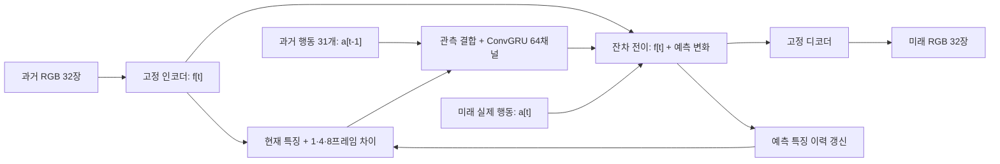

# Q3-1 · 행동 조건부 변화량 모델

행동 라벨이 있는 200개 영상 전체를 기존 `dev_subset`에 따라 학습 185개, 검증 15개로 나눈다.
학습 영상에는 127,268개 행동 전이, 검증 영상에는 10,913개 전이가 있다. 같은 영상의 프레임을 양쪽에 나누지 않는다.
기존 비라벨 영상 전용 가중치를 초기값으로 사용하지 않고 새 모델을 학습한다. 제공된 시각 stem의 구조와 가중치는 고정한다.

## 행동과 프레임의 시간 정렬

`a[t]`는 `I[t]`에서 `I[t+1]`로 이동할 때 적용된다. 따라서 관측 `I[t]`를 기억에 넣을 때는
관측 변화 `f[t]-f[t-1]`와 그 변화를 만든 이전 행동 `a[t-1]`를 함께 넣는다.
다음 관측을 예측할 때는 현재 행동 `a[t]`를 별도로 전이 모델에 넣는다.

```text
I[t-1] ── 실제 a[t-1] ──> I[t] ── 주어진 a[t] ──> 예측 I[t+1]
       관측 변화와 기억 갱신              다음 상태의 전이
```

관측 특징 `f[t] = E(I[t])`는 48×16×16이다. 기억 입력은 현재 특징, 특징 차이
`f[t]-f[t-1]`, `f[t]-f[t-4]`, `f[t]-f[t-8]`, 그리고 이전 행동의 16차원 embedding이다.
25 Hz에서 차이의 간격은 0.04 / 0.16 / 0.32초다. 32프레임 관측의 처음과 끝 사이 시간은 1.24초다.
프레임과 행동은 원래 시간 간격으로 모두 기억에 들어간다. 긴 간격의 차이를 사용해도 중간 행동을 생략하거나
한 개 행동을 4/8프레임 전체의 원인으로 취급하지 않는다. 아직 관측되지 않은 이전 프레임의 차이는 0으로 둔다.



전이 모델은 현재 특징·64채널 기억·실제 행동 embedding에서 다음 특징의 잔차를 예측한다.
입력 행동은 `[-1,1]`의 실제 라벨이다. 영상 전용 모델의 잠재 행동 prior/posterior와 KL은 사용하지 않는다.
예측한 특징은 다시 기억에 들어가고, 다음 행동으로 이어서 예측한다. 평가에서는 미래 정답 특징을 기억에 넣지 않는다.

## 학습 목표

주 손실은 주어진 행동으로 자율 예측한 특징의 motion-weighted Smooth L1이다.
학습 중에만 실제 이전 특징을 사용하는 teacher 보조 경로를 두되 자율 경로와 상태를 분리한다.
흐릿한 막대를 직접 점검하도록, 자율 예측의 첫/마지막 프레임 최대 2장에 디코딩된 RGB와 윤곽 손실을 추가한다.
색상 기반 물체 영역을 강조하는 mask는 GT segmentation이 아니라 보조 휴리스틱이다.
디코더 파라미터가 고정돼도 RGB 손실의 gradient는 예측 특징을 통해 전이 모델로 전달된다.

기본 가중치는 자율 특징 1, teacher 특징 0.25, RGB 0.1, 윤곽 0.05다.
T4에서 RGB 디코더를 모든 미래 프레임의 backward에 사용하지 않도록 희소 손실을 선택했다.
이 가중치와 간격이 최적이라는 주장은 하지 않으며, 첫 기본 실험의 검증 결과로 판단한다.

## T4 실행과 재개

- 모델: 438,624 학습 파라미터. 제공된 고정 stem: 940,892 파라미터.
- 상태: 64채널 기억과 최대 9개 특징 grid. 기본 크기에서 약 0.254 MB FP16 / 0.508 MB FP32 per item.
- Batch 4, CUDA FP16 autocast + GradScaler, AdamW learning rate 0.0003, gradient clipping 1.
- 총 4,000 업데이트. 예측 길이 1→4→8→16→32, 2,200 업데이트부터 32프레임.
- 학습 에피소드 185개를 섞은 전체 순회를 반복해 모든 에피소드를 사용한다. 각 에피소드 안에서 연속 window를 뽑는다.
- 검증은 500번마다 같은 15개 영상의 최초 32장·과거 행동 31개·미래 행동 32개로 수행한다.
- 250번마다 모델·optimizer·AMP scaler·모든 난수 상태·에피소드 순회 cursor를 저장한다.
- 캐시는 원본 영상·행동 sidecar·stem·에피소드 분할 fingerprint를 검사한다. 비라벨 또는 영상 전용 cache/checkpoint는 거절한다.
- 결과는 `latest.pt`, `best.pt`, `final.pt`, `run.json`, `training.jsonl`, `completion.json`, `validation/step_XXXXXX/`에 보존한다.

RGB MSE 기준 best와 최종 모델을 구분한다. 검증의 Copy-last는 마지막 관측 특징을 디코딩해 반복한 기준선이다.
1/8/16/32프레임 RGB 오차, 물체 영역 보조 오차, 잘못 정렬한 미래 행동의 RGB 오차와 행동 변화에 따른 특징 변화도 기록한다.
후자의 진단은 행동 입력 사용 여부를 점검하며, 다른 행동에 대한 실제 정답 영상을 가진 반사실 평가가 아니다.
공식 점수와 3-2 제어·7개 ONNX 제출은 별도 작업이다.

## 실행

```bash
python -m action_wam.cli prepare --kit /path/to/kit --cache /content/q3-action-cache --config configs/action_t4.json --device cuda
python -m action_wam.cli train --kit /path/to/kit --cache /content/q3-action-cache --out /content/q3-action-runs/action-difference-t4-v1 --config configs/action_t4.json --persist /content/drive/MyDrive/krafton-q3-video-worldmodel/runs/action-difference-t4-v1 --device cuda
```

Colab에서는 `notebooks/train_action_difference_t4.ipynb`가 위 절차와 데이터 staging, 검증, 재개, 결과 표시를 실행한다.
학습 코드는 GitHub가 원본이며 노트북은 실행 진입점이다.
